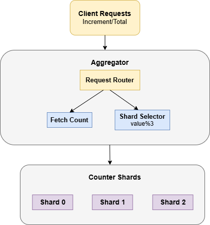
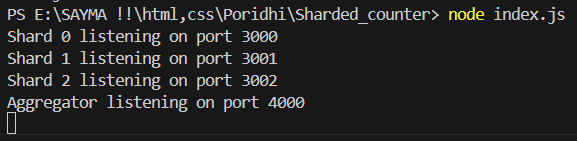
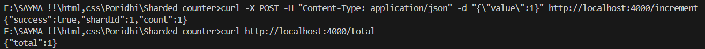

# 🚀 Sharded Counter System in Node.js

## 🔹 Introduction

A **Sharded Counter System** is a distributed system that splits a counter across multiple **shards (nodes)** to improve performance and scalability. Instead of a **single counter**, the system distributes the load across multiple servers, and an **aggregator** collects the counts to return the total efficiently.

This approach is useful in **high-traffic** applications like:

- 📊 Analytics & Metrics
- 🏆 Leaderboards
- 🚦 Rate Limiting

## 🏗 Architecture Overview

The system consists of **three key components**:

1️⃣ **Client Requests** (Web Browser, API Calls)  
2️⃣ **Aggregator Service** (Manages routing & aggregation)  
3️⃣ **Counter Shards** (Distributed storage of counters)

### 📌 **Architecture Diagram**



## ⚙ **How It Works**

### **Starting the System**

Run the following command to start the system:

```bash
node index.js
```

This will start three shard servers (on ports 3000, 3001, and 3002) and the aggregator server (on port 4000).



### **Incrementing a Value**

To increment the counter by 1, run:

```bash
curl -X POST -H "Content-Type: application/json" -d "{\"value\":1}" http://localhost:4000/increment
```

**Process**

- The request is sent to the Aggregator (Port 4000).
- The Aggregator determines which shard should process it using **value % totalShards**.
  - Example: 1 % 3 = 1, so Shard 1 handles the request.
- The Aggregator forwards the request to Shard 1 (Port 3001).
- Shard 1 increments its local counter and responds with the updated value.

**Getting the Total Count**

```bash
curl http://localhost:4000/total
```

**Process**

- The request is sent to the Aggregator.
- The Aggregator queries all shards to get their current counts.
- The Aggregator sums up the counts from all shards and returns the total value.

**Expected Output:**


## ⚡ Running the System

### ✅ **Step 1: Install Dependencies**

```bash
npm install express axios
```

### ✅ **Step 2: Start the System**

```bash
node index.js
```

### ✅ **Step 3: Test the System**

➕ Increment by 5

```bash
curl -X POST -H "Content-Type: application/json" -d "{\"value\":5}" http://localhost:4000/increment
```

📊 Get Total Count

```bash
curl http://localhost:4000/total
```
